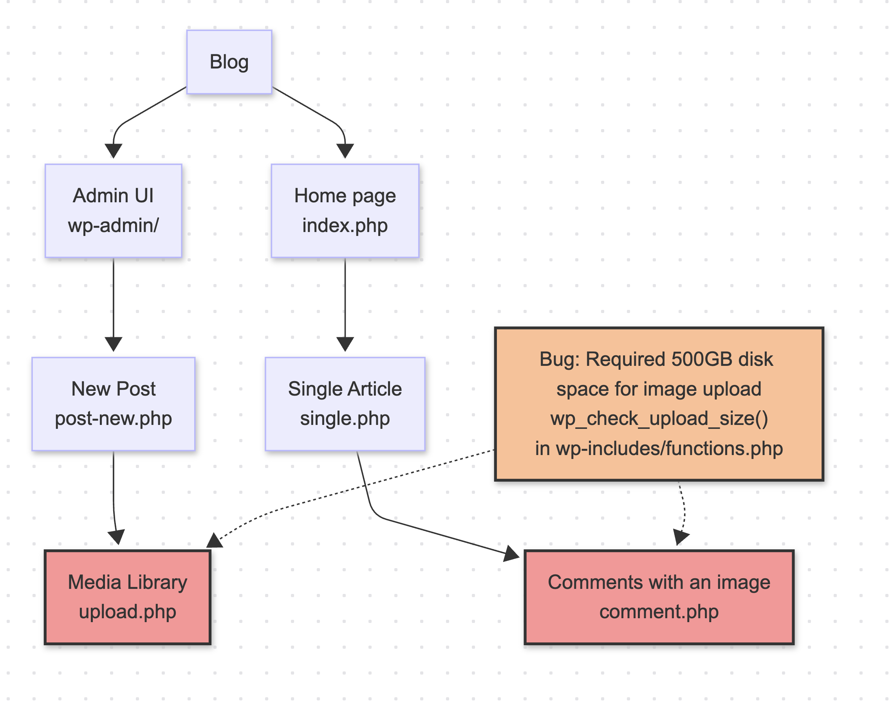

<h1 align="center">Incident Diagram 🗾</h1>
<div align="center">
  
  
  
  
  
  
</div>
<br>
Generates a diagram highlighting what happened during an incident by ingesting the retrospective and associated codebase. LLM-powered.

```
$ incidentdiagram -f example_incident.txt  -u https://github.com/user/impactedcodebase
.
Chart generated in artifacts/incident.md
```

<div align="center">
   
</div>

In the fictional scenario illustrated above, the diagram shows an outage affecting a blog. A developer introduced a new feature to verify disk space before image uploads, but mistakenly set the requirement to 500GB. Production servers did not have this amount of available space, preventing the blog admin from uploading images to new posts and readers from adding images to their comments.

## Requirements 📋
* `.env` file with OpenAPI/Gemini/Anthropic API Key (at least one)
* Python > 3.10

## Getting started 🚀
```
python -m venv .venv
source .venv/bin/activate
pip install .
cp .example.env .env # Add api keys to .env after copying
incidentdiagram -f example_incident.txt  -u https://github.com/Rootly-AI-Labs/EventOrOutage
```
The example above uses an incident that goes along with the app `https://github.com/Rootly-AI-Labs/EventOrOutage` and a fictive incident retrospective in  `example_incident.txt`.

## How it works
IncidentDiagram process works in 3 main steps:

 1. Understand the impacted codebase, the file structure, and the code within the files to generate a description of components and their relationships. Returned in JSON format.
 2. Understand postmortem/incident retrospective and provide a list of components that were affected, matching the components of the codebase. Returned in JSON format.
 3. Create a diagram(mermaid.js) showing the components and their relationships, highlighting the components the incident affected. Returned in a MD format.


All of these steps are done by prompting LLMs
## Examples 📖
Here are a few ways you can use IncidentDiagram:
* `incidentdiagram -f incident.txt  -u https://github.com/Rootly-AI-Labs/EventOrOutage` – will download the code from github and generate a diagram based on the incident summary in incident.txt
* `incidentdiagram -f incident.txt  -u https://github.com/Rootly-AI-Labs/EventOrOutage/tree/main -m gpt-4o` – Use a different model
* `incidentdiagram -iu www.postmortems.com/1345  -u https://github.com/Rootly-AI-Labs/EventOrOutage -m claude-3.5` – Download the incident summary from a URL and generate a diagram

## Stack 🛠️
-   **LLMs:** [Open AI LLMs](https://platform.openai.com/docs/api-reference/models), [Anthropic LLMs](https://docs.anthropic.com/en/api/models-list), [Gemini LLMs](https://ai.google.dev/api/models).
-   **Agent:** HuggingFace smolagents
-   **Data Sources:** External APIs for holidays, news, and event tracking

## Notes & Future Improvements
- Ability to handle a large application code base
- Ability to ingest multiple code bases and IaC files
- Add ollama models

This is a prototype meant to demonstrate how LLM can have a positive impact on SRE teams and is not meant to be used in production.

## Backstory for this prototype
Explaining an outage can be challenging, especially for complex incidents in distributed systems, which have become the norm. People also have different preferences for how information is presented, and often, a visual representation is worth a thousand words. However, manually creating application and infrastructure diagrams is time-consuming, making it impractical to do so for every incident. That's why we believe **Incident Diagram** could be a valuable tool for SREs and on-call practitioners, helping them quickly visualize and understand what went wrong.

## About the Rootly AI Labs
This project was developed by the [Rootly AI Labs](https://labs.rootly.ai/). The AI Labs is building the future of system reliability and operational excellence. We operate as an open-source incubator, sharing ideas, experimenting, and rapidly prototyping. We're committed to ensuring our research benefits the entire community.

