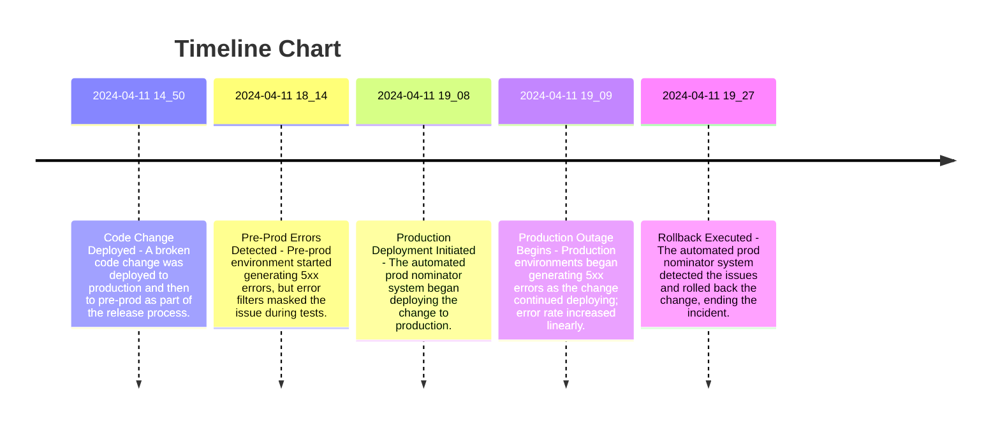
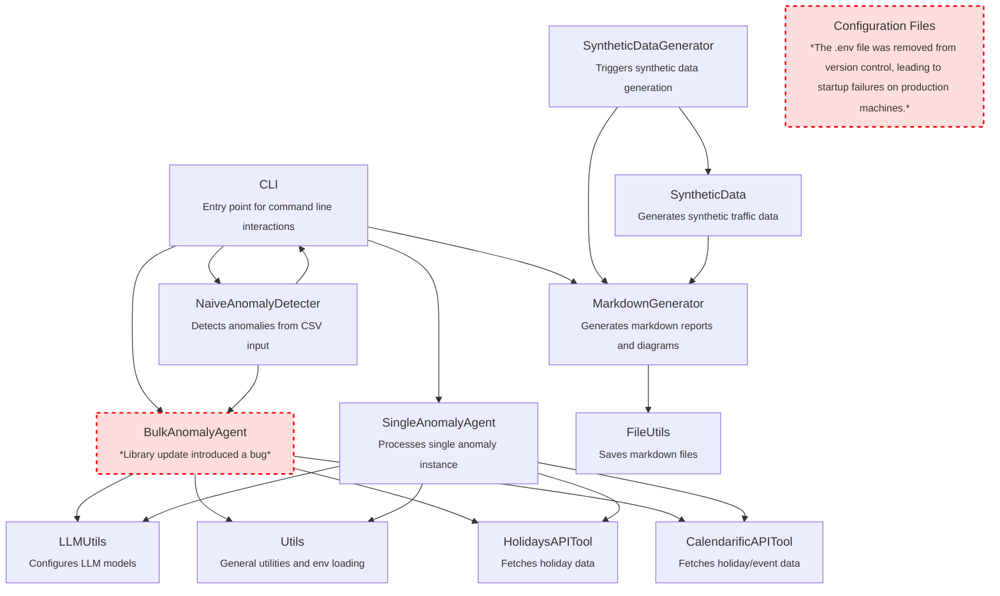

```mermaid
timeline
    title Timeline Chart
    2024-04-11 14_50 : Code Change Deployed - A broken code change was deployed to production and then to pre-prod as part of the release process.
    2024-04-11 18_14 : Pre-Prod Errors Detected - Pre-prod environment started generating 5xx errors, but error filters masked the issue during tests.
    2024-04-11 19_08 : Production Deployment Initiated - The automated prod nominator system began deploying the change to production.
    2024-04-11 19_09 : Production Outage Begins - Production environments began generating 5xx errors as the change continued deploying; error rate increased linearly.
    2024-04-11 19_27 : Rollback Executed - The automated prod nominator system detected the issues and rolled back the change, ending the incident.
```

```mermaid

%% Mermaid diagram with a hand drawn look (simulated by dashed red stroke)
flowchart TD
    CLI[CLI<br/><sub>Entry point for command line interactions</sub>]
    SingleAnomalyAgent[SingleAnomalyAgent<br/><sub>Processes single anomaly instance</sub>]
    BulkAnomalyAgent[BulkAnomalyAgent<br/><sub>*Library update introduced a bug*</sub>]
    NaiveAnomalyDetecter[NaiveAnomalyDetecter<br/><sub>Detects anomalies from CSV input</sub>]
    LLMUtils[LLMUtils<br/><sub>Configures LLM models</sub>]
    MarkdownGenerator[MarkdownGenerator<br/><sub>Generates markdown reports and diagrams</sub>]
    FileUtils[FileUtils<br/><sub>Saves markdown files</sub>]
    Utils[Utils<br/><sub>General utilities and env loading</sub>]
    SyntheticData[SyntheticData<br/><sub>Generates synthetic traffic data</sub>]
    SyntheticDataGenerator[SyntheticDataGenerator<br/><sub>Triggers synthetic data generation</sub>]
    CalendarificAPITool[CalendarificAPITool<br/><sub>Fetches holiday/event data</sub>]
    HolidaysAPITool[HolidaysAPITool<br/><sub>Fetches holiday data</sub>]
    ConfigFiles["Configuration Files<br/><sub>*The .env file was removed from version control, leading to startup failures on production machines.*</sub>"]

    %% Relationships
    CLI --> SingleAnomalyAgent
    CLI --> BulkAnomalyAgent
    CLI --> NaiveAnomalyDetecter
    CLI --> MarkdownGenerator

    BulkAnomalyAgent --> LLMUtils
    BulkAnomalyAgent --> Utils
    BulkAnomalyAgent --> HolidaysAPITool
    BulkAnomalyAgent --> CalendarificAPITool

    SingleAnomalyAgent --> LLMUtils
    SingleAnomalyAgent --> Utils
    SingleAnomalyAgent --> HolidaysAPITool
    SingleAnomalyAgent --> CalendarificAPITool

    NaiveAnomalyDetecter --> CLI
    NaiveAnomalyDetecter --> BulkAnomalyAgent

    MarkdownGenerator --> FileUtils

    SyntheticDataGenerator --> SyntheticData
    SyntheticDataGenerator --> MarkdownGenerator

    SyntheticData --> MarkdownGenerator

    %% Highlight affected components with hand-drawn style
    class BulkAnomalyAgent,ConfigFiles affected;
    classDef affected fill:#fdd,stroke:#f00,stroke-width:2px,stroke-dasharray: 5 5;

```
