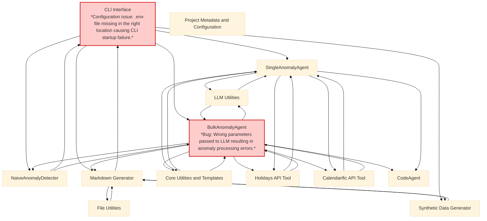
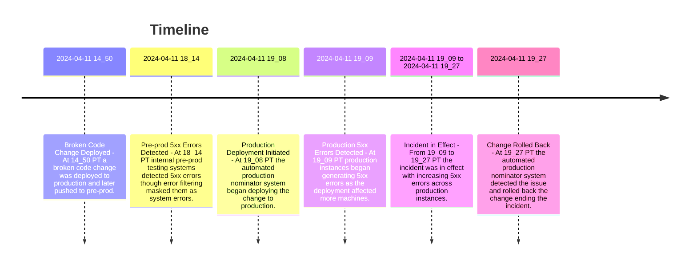

```mermaid

%%{init: {'theme': 'base', 'themeVariables': { 'handDrawn': true }}}%%
graph TD
    %% Nodes definition with labels and notes for affected nodes
    CLI[CLI Interface<br>*Configuration issue: .env file missing in the right location causing CLI startup failure.*]
    Bulk[BulkAnomalyAgent<br>*Bug: Wrong parameters passed to LLM resulting in anomaly processing errors.*]
    Single[SingleAnomalyAgent]
    Naive[NaiveAnomalyDetecter]
    Synthetic[Synthetic Data Generator]
    Markdown[Markdown Generator]
    File[File Utilities]
    LLM[LLM Utilities]
    Core[Core Utilities and Templates]
    Holidays[Holidays API Tool]
    Calendarific[Calendarific API Tool]
    Project[Project Metadata and Configuration]
    CodeAgent[CodeAgent]

    %% Edges from CLI Interface
    CLI --> Single
    CLI --> Bulk
    CLI --> Naive
    CLI --> Markdown
    CLI --> Synthetic

    %% Edges for BulkAnomalyAgent
    Bulk --> LLM
    Bulk --> Core
    Bulk --> Holidays
    Bulk --> Calendarific
    Bulk --> CodeAgent
    Bulk --> Markdown
    Bulk --> Naive

    %% Edges for SingleAnomalyAgent
    Single --> LLM
    Single --> Core
    Single --> Holidays
    Single --> Calendarific
    Single --> CodeAgent

    %% Edges for NaiveAnomalyDetecter
    Naive --> CLI
    Naive --> Bulk

    %% Edges for Synthetic Data Generator
    Synthetic --> Markdown

    %% Edges for Markdown Generator
    Markdown --> File
    Markdown --> CLI
    Markdown --> Synthetic

    %% Edges for File Utilities
    File --> Markdown

    %% Edges for LLM Utilities
    LLM --> Single
    LLM --> Bulk

    %% Edges for Core Utilities and Templates
    Core --> Single
    Core --> Bulk

    %% Edges for Holidays API Tool
    Holidays --> Single
    Holidays --> Bulk

    %% Edges for Calendarific API Tool
    Calendarific --> Single
    Calendarific --> Bulk

    %% Project Metadata and Configuration has no relationships

    %% Styling for affected components (highlighting)
    classDef affected fill:#ffcccc,stroke:#cc0000,stroke-width:2px;
    class CLI,Bulk affected;

```

```mermaid
timeline
    title Timeline
    2024-04-11 14_50 : Broken Code Change Deployed - At 14_50 PT a broken code change was deployed to production and later pushed to pre-prod.
    2024-04-11 18_14 : Pre-prod 5xx Errors Detected - At 18_14 PT internal pre-prod testing systems detected 5xx errors though error filtering masked them as system errors.
    2024-04-11 19_08 : Production Deployment Initiated - At 19_08 PT the automated production nominator system began deploying the change to production.
    2024-04-11 19_09 : Production 5xx Errors Detected - At 19_09 PT production instances began generating 5xx errors as the deployment affected more machines.
    2024-04-11 19_09 to 2024-04-11 19_27 : Incident in Effect - From 19_09 to 19_27 PT the incident was in effect with increasing 5xx errors across production instances.
    2024-04-11 19_27 : Change Rolled Back - At 19_27 PT the automated production nominator system detected the issue and rolled back the change ending the incident.
```
