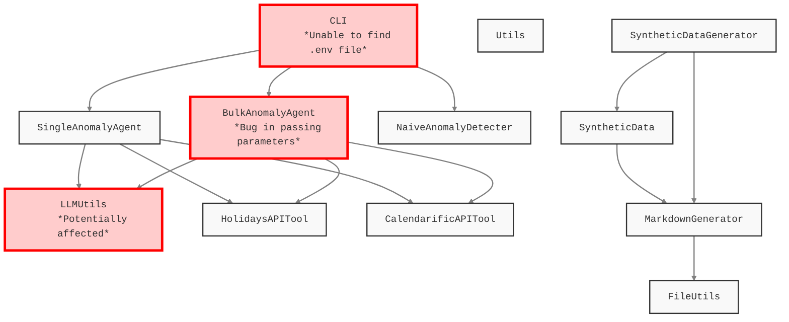

```mermaid

%%{init: {'theme': 'base', 'themeVariables': { 'fontFamily': 'courier' }}}%%
flowchart TD
    classDef default fill:#f9f9f9,stroke:#333,stroke-width:2px;
    classDef affected fill:#ffcccc,stroke:#ff0000,stroke-width:3px;
    
    CLI["CLI
    *Unable to find .env file*"]:::affected
    SingleAnomalyAgent["SingleAnomalyAgent"]
    BulkAnomalyAgent["BulkAnomalyAgent
    *Bug in passing parameters*"]:::affected
    NaiveAnomalyDetecter["NaiveAnomalyDetecter"]
    LLMUtils["LLMUtils
    *Potentially affected*"]:::affected
    Utils["Utils"]
    HolidaysAPITool["HolidaysAPITool"]
    CalendarificAPITool["CalendarificAPITool"]
    SyntheticData["SyntheticData"]
    SyntheticDataGenerator["SyntheticDataGenerator"]
    MarkdownGenerator["MarkdownGenerator"]
    FileUtils["FileUtils"]

    CLI --> SingleAnomalyAgent
    CLI --> BulkAnomalyAgent
    CLI --> NaiveAnomalyDetecter
    SingleAnomalyAgent --> LLMUtils
    SingleAnomalyAgent --> HolidaysAPITool
    SingleAnomalyAgent --> CalendarificAPITool
    BulkAnomalyAgent --> LLMUtils
    BulkAnomalyAgent --> HolidaysAPITool
    BulkAnomalyAgent --> CalendarificAPITool
    SyntheticData --> MarkdownGenerator
    SyntheticDataGenerator --> SyntheticData
    SyntheticDataGenerator --> MarkdownGenerator
    MarkdownGenerator --> FileUtils

    linkStyle default stroke-width:2px,fill:none,stroke:gray,style:hand-drawn
    style CLI stroke-width:4px,stroke:#ff0000,style:hand-drawn
    style BulkAnomalyAgent stroke-width:4px,stroke:#ff0000,style:hand-drawn
    style LLMUtils stroke-width:4px,stroke:#ff0000,style:hand-drawn

```